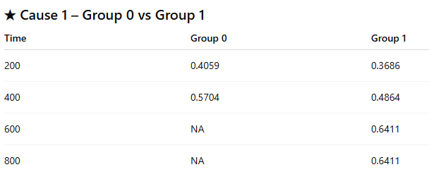
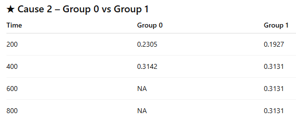
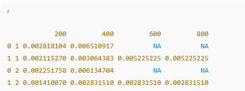

```{r}
library(survival)
library(cmprsk)
```
# 1. Create Example Data

```{r}
set.seed(123)
n <- 300
time <- rexp(n, 0.1) * 12 # Event times in months
trt <- rbinom(n, 1, 0.5) # Treatment indicator

# Event type: 0 = censor, 1 = primary event, 2 = competing event
event <- sample(c(0, 1, 2), n, replace = TRUE, prob = c(0.5, 0.3, 0.2))

dat <- data.frame(time, event, trt)
head(dat)


```


# 2. Estimate the Cumulative Incidence Function (CIF)
The CIF is the correct estimator under competing risk not Kaplan Meier.

```{r}
# CIF for event type 1 by treatment group.
cif1 <- cuminc(ftime = dat$time,
               fstatus = dat$event,
               group = dat$trt)

cif1
```
This gives the following:

    1. CIF for event type 1 in both treatment groups.
    2. CIF for event type 2.
    3. Gray's test p-value for comparing stratified CIFs.
    
How to Read `cuminc()` Results:
    1. "Tests" Section: these are Gray's tests comparing cumulative incidence between your two groups for each cause.  
        a. Row 1 = Cause 1 (event of interest):
            1) `stat = 0.2524`
            2) `pv = 0.6154`
        b. Row 2 = Cause 2 (competing event):
            1) `stat = 0.0050`
            2) `pv = 0.9436`
        c. Interpretation:
            1) For cause 1: p = 0.615 -> no significant difference betwee n treatment groups in incidence of event 1. 
            2) For cause 2: p = 0.944 -> no significant difference between treatment groups in incidence of event 2. 
            3) Conclusion: the cumulative incidence curves for both causes are similar between the two treatment groups. 
    2. "Estimates and Variances" Section: there are two lists: `est` for the cumulative incidence estimates and `var` for the variances of these cumulative incidence estimates. 
        a. CIF Estimates: `$est`:
            1) Each row is labeled: [group][cause]
                a) 0 1 = group 0 cause 1
                b) 1 1 = group 1 cause 1
                c) 0 2 = group 0 cause 2
                d) 1 2 = group 1 cause 2
            2) Each column is labeled by a number corresponding to a time point: numbers (200, 400, 600, 800) are time points. 
                a) values under each column are cumulative incidence probabilities. 
            3) Interpret Each Part:
                a) Cause 1: Group 0 vs Group 1
                
                Interpretation:
                    i. At time 400, group 0 has CIF = 57%, group 1 has CIF = 49%.
                    ii. At later times, group 0 has no events -> entries become NA.
                    iii. Group 1 continues accumulating events up to time 600.
                b) Cause 2: Group 0 vs. Group 1
                
                Interpretation:
                    i. Both groups have similar cumulative incidence of cause 2. 
                    ii. Group 0 does not have events beyond time 400 -> NA entries. 
            4) Big-picture Interpretation of CIFs:
                a) Group 0 has events only up to ~400 time units for both causes. 
                b) Group 1 has events extending through 600-800 time units for both causes. 
                c) CIF values are slightlyl higher in group 0 for early times, but Gray's test indicates no differences between groups for either cause. 
    
        b. Variances: `$var`
        
          1) These are the variances of the CIF estimates.
          2) Typically used for calculating confidence intervals. 
    3. Summary:
      a. Gray's Test:
          1) Cause 1: no significant difference between group 0 and group 1 with p = 0.615.
          2) Cause 2: no significant difference between group 0 and group 1 with p = 0.944.
      b. CIFs:
          1) Group 0 has events only up to time ~400 -> later values = NA.
          2) Group 1 has events through time 600-800.
          3) CIF curves for both groups are similar for both causes. 
              
        

# 3. Plot CIF Curves

```{r}
plot(cif1, lty = 1, col = c("blue", "red", "blue4", "red4"))
legend("topleft",
       legend = c(
         "Event 1: trt = 0", "Event 1: trt = 1",
         "Event 2: trt = 2", "Event 2: trt = 1"
       ),
       col = c("blue", "red", "blue4", "red4"),
       lty = 1)
```

# 4. Compare Groups Using Gray's Test

Gray's tet is already included inside `cuminc()`. To extract p-value:

```{r}
cif1$Tests
```
# 5. Fit a Fine-Gray Subdistribution Hazard Model

This models the effect of covariate on the subdistribution hazard for the event of interest (event type = 1).

```{r}
fg <- crr(
  ftime = dat$time,
  fstatus = dat$event,
  cov1 = dat["trt"], # Dataframe of covariate.
  failcode = 1, # Event of interest.
  cencode = 0 # Censored indicator
)

summary(fg)
```
This output gives the following:
    1. Subdistribution hazard ratio (SHR).
        a. Interpretation:
            1) SHR < 1: treatment reduces the cumulative incidence of event 1.
            2) SHR > 1: treatment increases the cumulative incidence of event 1. 
    2. 95% confidence interval.
    3. p-value.

Interpretation of SHR

