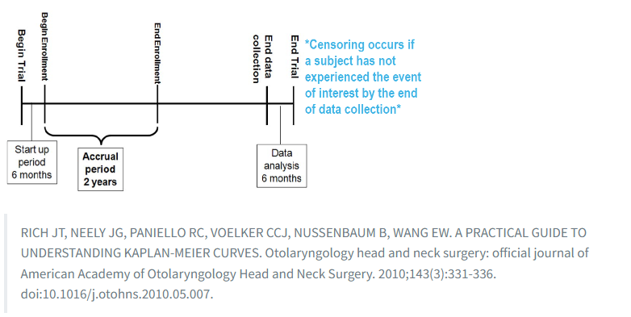
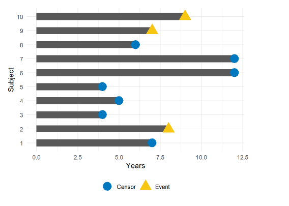
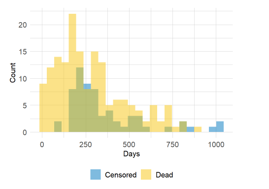
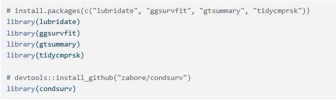
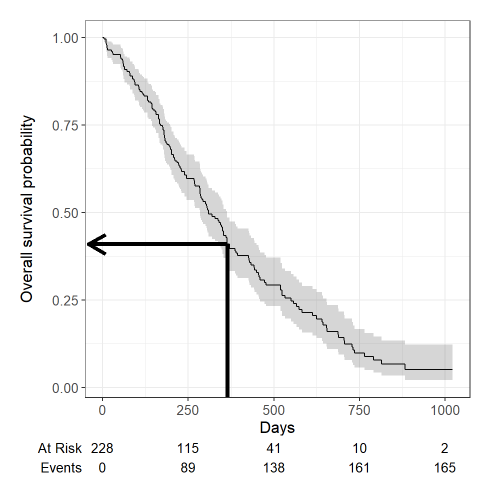
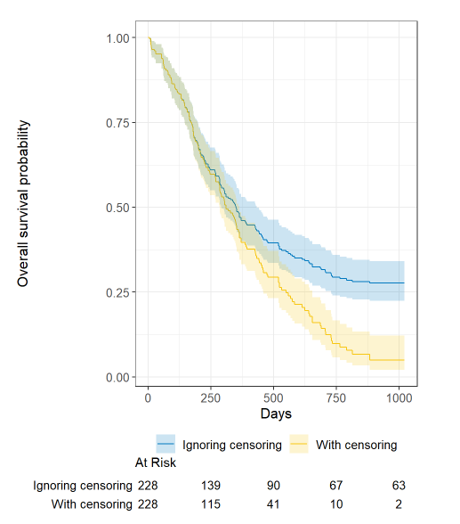
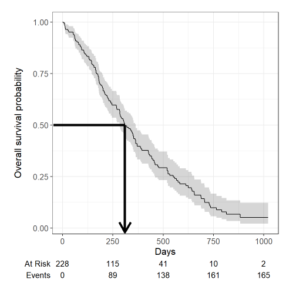
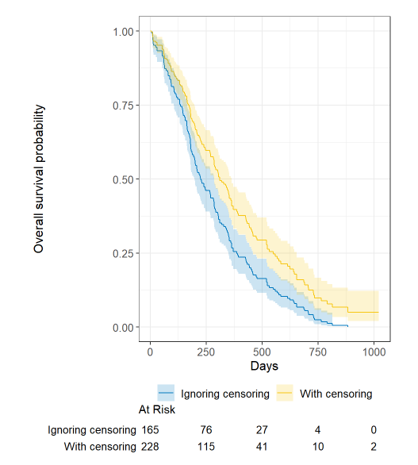

Source: https://www.emilyzabor.com/survival-analysis-in-r.html

```{r}
library(knitr)
library(dplyr)
library(survival)
library(ggplot2)
library(tibble)
library(lubridate)
library(ggsurvfit)
library(tidycmprsk)
library(gtsummary)

ezfun::set_ccf_palette("contrast")
```
# Part 1: Introduction to Survival Analysis

Tutorial Papers:

Clark, T., Bradburn, M., Love, S., & Altman, D. (2003). Survival analysis part I: Basic concepts and first analyses. 232-238. ISSN 0007-0920.

M J Bradburn, T G Clark, S B Love, & D G Altman. (2003). Survival Analysis Part II: Multivariate data analysis – an introduction to concepts and methods. British Journal of Cancer, 89(3), 431-436.

Bradburn, M., Clark, T., Love, S., & Altman, D. (2003). Survival analysis Part III: Multivariate data analysis – choosing a model and assessing its adequacy and fit. 89(4), 605-11.

Clark, T., Bradburn, M., Love, S., & Altman, D. (2003). Survival analysis part IV: Further concepts and methods in survival analysis. 781-786. ISSN 0007-0920.


## The Basics
1. Survival data are time-to-event data that consist of a distinct start time and end time. 

  a. Examples from cancer:
    - Time from surgery to death
    - Time from start of treatment to progression
    - Time from response to recurrence
  b. Time-to-event data are common in many other fields. Some other examples include:
    - Time from HIV infection to development of AIDS
    - Time to heart attack
    - Time to onset of substance abuse
    - Time to initiation of sexual activity
    - Time to machine malfunction
  c. Because time-to-event data are common in many fields, it also goes by names besides survival analysis including:
    - Reliability analysis
    - Duration analysis
    - Event history analysis
    - Time-to-event analysis
  
2. A key feature of survival data is **censoring**.


  a. A subject may be censored due to:
    - Loss to follow up
    - Withdrawl from study
    - No event by end of fixed study period
  b. Above examples are all **right** censoring.
  c. Left censoring and interval censoring are also possible, and there are methods specifically for analyzing these types of data. 
  d. Impact of censoring:
  
    - Compute the proportion who are event-free at 10 years:
      - Subject 6 and 7: event-free at 10 years.
      - Subjects 2, 9, and 10: had the event before 10 years.
      - Subjects 1, 3, 4, 5, and 8: censored before 10 years.
        - For those subjects, we do not know whether they had the event or not at 10 years.
        - We know that they were each followed for a certain amount of time without the event of interest prior to being censored. 
        
3. Why Survival Analysis?
  a. Survival analysis techniques provide a way to appropriately account for censored patients in the analysis.
  b. Survival analysis techniques are needed as the distribution of follow-up time is skewed, and may differ between censored patients and those with events. 
  c. Survival analysis techniques are needed because follow-up times are always positive. 
  d. Example of the distribution of follow-up times according to event status:
  

4. Analyze Survival Data:
  a. To analyze survival data, we need to know:
    - Observed Time $Y_i = min(T_i, C_i)$.
      - $T_i$: event time.
      - $C_i$: censoring time.
    - Event Indicator $\delta_i$:
      - $\delta_i = 1$ if event observed  (i.e. $T_i \leq C_i$).
      - $\delta_i = 0$ if censored (i.e. $T_i > C_i$).
  b. The probability that a subject will survive beyond any given specified time is described by the survival function $S(t)$:
    - $S(t) = Pr(T > t) = 1 - F(t)$
      - $F(t) = Pr(T\leq t)$: cumulative distribution function of time T.
    - In theory the survival function is smooth.
    - In practice we observe event on discrete time scale. 
    - $S(t)$ describes the **survival probability** at a certain time $t$, which is a conditional probability of surviving beyond that time $t$, given that an individual has survived just prior to that time. 
  c. Estimation of Survival Probability $S(t)$:
    - The survival probability can be estimated as:
      - number of patients alive without loss to follow-up at that time / number of patients who were alive just prior to that time
    - **Kaplan-Meier Estimator**: the Kaplan-Meier estiamte of survival probability at any given time is the product of these conditional probabilities up until that given time. 
      - At time 0, the survival probability is 1 (i.e. $S(t_0) = 1$).
      
      
## R Analysis

1. Packages needed for this analysis:


2. The `lung` Dataset

  a. Example Data: the `lung` dataset from the {survival} package. 
  b. The data contain subjects with advanced lung cancer from the North Central Cancer Treatment Group. 
  c. Relevant Variables:
    - time: observed survival time in days.
    - status: censoring status.
      - censored = 1
      - dead = 2
    - sex: 
      - male = 1
      - female = 2
  d. Because the status is coded in a non-standard way in this dataset, we recode it to event = 1 and censored = 0.
    - The `Surv` function in the {survival} package accepts the following coding of status by default:
      - TRUE/FALSE: TRUE = event; FALSE = censored
      - 1/0: 1 = event; 0 = censored
      - 2/1: 2 = event; 1 = censored
  
```{r}
lung <- lung %>% mutate(
  status = recode(status, `1` = 0, `2` = 1)
)
 
```
  e. Example of data in `lung`: the first 6 observations.

```{r}
head(lung[, c("time", "status", "sex")])
```


### Calculating Survival Times

1. Data will often come with start and end dates rather than pre-calculated survival times. 
  a. Ensure start and end dates are formatted as dates in R.
    - Example: `sx_date` is surgery date; `last_fup_date` is last follow-up date.
```{r}
date_ex <- 
  tibble(
    sx_date = c("2007-06-22", "2004-02-13", "2010-10-27"),
    last_fup_date = c("2017-04-15", "2018-07-04", "2016-10-31"))


date_ex
  
```
      - We see that both `sx_date` and `last_fup_date` are coded as character variables, but wee ned them to be formatted as dates. 
      - We will use the {lubricate} package to work with dates. 
        - Since the dates are currently in the character format "year-month-day", we need to use `ymd()` functio to change the format. 
```{r}
date_ex <-
  date_ex %>% mutate(
    sx_date = ymd(sx_date),
    last_fup_date = ymd(last_fup_date)
  )

date_ex
```
    - Now the two dates are no longer character variables but date variables. 
    - Calculate the difference between start and end dates in some units (e.g. months, years) using the operator `%--%` which designates a time interval.
      - The time interval is then converted to the number of elapsed seconds using `as.duration()`.
      - Using the special oprators such as `%--%` requires loading the library lubridate (i.e. cannot use lubridate::ymd() and then use the special operator such as `%--%`).
      - Finally, the number of elapsed seconds are converted to years by dividing by `dyears(1)`, which gives the number of seconds in one year. 
```{r}
date_ex <- date_ex %>% 
  mutate(
    os_yrs = as.duration(sx_date %--% last_fup_date) / dyears(1)
  )

date_ex
```


### Creating Survival Objects and Curves
1. The Kaplan-Meier method is the most common way to estimate survival times and probabilities. 
  a. KM method is a non-parametric approach that results in a **step function**.
    - There is a step down each time an event occurs. 

2. The `Surv()` function from the {survival} package creates a survival object for *use as the response in a model formula*. 
  a. There will be *one entry for each subject* that is the **survival time**.
    - If the subject was censored, its survival time will be followed by a **+** sign. 
      - These survival times are from the `time` variable from the dataset, what the function `Surv()` does is to create a survival object where the survival time and censored time are distinguished using the sign **+**.
```{r}

Surv(lung$time, lung$status)[1:10]
```
      - Subject 1 had an event at time 306 days.
      - Subject 2 had an event at time 455 days.
      - Subject 3 was censored at time 1010 days. 
      - etc.


3. The `survfit()` function creates survival curves using the Kaplan-Meier method based on a formula. 
  a. We perform the following:
    - Generate the overall survival curv for the entire cohort. 
    - Assign the generated overall survival curv to object `s1`.
    - Examine the structure of the generated overall survival curv object using `str()`. 
```{r}
s1 <- survfit(Surv(time, status) ~ 1, data = lung)

str(s1)
```
  b. Some key components of this `survfit` object that will be used to create survival curves:
    - `time`: the timepoints at which the curve has a step (i.e. at least one event occurred).
    - `surv`: the estimate of survival (i.e. survival probability) at the corresponding `time`. 


### Kaplan-Meier Plots

1. Use the {ggsurvfit} package to generate Kaplan-Meier plots. 
  - Survival plots can also be created using base R or the {survminer} package. 

2. The {ggsurvfit} package works best if you create the `survfit` object using the included `ggsurvfit::survfit2()` function. 
  - `ggsurvfit::survfit2()` uses the same syntax to `survival::survfit()`. 
  - The `ggsurvfit::survfit2()` tracks the environment from the function call, which allows the plot to have better default values for labeling and p-value reporting. 
  
```{r}
survfit2(Surv(time, status) ~ 1, data = lung) %>% 
  ggsurvfit() + 
  labs(
    x = "Days",
    y = "Overall Survival Probability"
  )
```

3. The default plot in `ggsurvfit()` shows the step function only, but we can add the confidence interval using `add_confidence_interval()` layer. 

```{r}
survfit2(Surv(time, status) ~ 1, data = lung) %>% 
  ggsurvfit() + 
  labs(
    x = "Days",
    y = "Overall Survival Probability"
  ) + 
  add_confidence_interval()
```

4. We can also add the numbers at risk in a table below the x-axis using `add_risktable()` layer. 
```{r}
survfit2(Surv(time, status) ~ 1, data = lung) %>% 
  ggsurvfit() + 
  labs(
    x = "Days",
    y = "Overall Survival Probability"
  ) + 
  add_confidence_interval() + 
  add_risktable()
```
  a. At time 0 day, there is no event and all individuals (i.e. 228 individuals) are at risk. 
  b. At time 1000 days, there are only 2 people without an event and were not censored. All others were either had an event before 1000 days or being censored before 1000 days. 
  
5. Survival plots using `ggsurvfit` can be customized using many standard `ggplot2` options. 


### Estimating x-year Survival
1. Common Quantity of Interest: one quantity often of interest in a survival analysis is the **probability of surviving beyond a certain number of years, $x$**.

  a. Example: estimate the probability of surviving to 1 year. 
    - Use `summary()` function with the `times` argument.
    - Because the `time` variable in the `lung` data is in days, we need to use argument `times = 365.25` (i.e. days in 1 year).
```{r}
summary(survfit(Surv(time, status) ~ 1, data = lung), times = 365.25)
```
  - The 1-year probability of survival in this study is estimated to be 40.9%.
    - The 1-year survival probability is the point on the y-axis that corresponds to 1 year on the x-axis for the survival curve. 


  
  b. Kaplan-Meier Estimator of Survival Prob vs. "Naive" Estimator of Survival Prob
    - "Naive" means that the patients who were censored prior to 1- year are considered event-free and is included in the denominator when estimate the survival probability using:
      - S(t) = number of patients alive at that time / number of patients who were alive just prior to that time 
      - This "Naive" estimator ignores censoring in the data. 
```{r}
event_within_1year <- lung %>% filter(
  time <= 365 & status == 1
) # 121 individuals had an event before year 1.

censored_within_1year <- lung %>% filter(
  time <= 365 & status == 0
) # Note 42 individuals were censored before year 1.

surv_past_1year <- lung %>% filter(
  time > 365 
) # 65 individuals survived past year 1. 

# Note that calculating this way will include 42 individuals censored prior to 1 year as event free within 1 year.
## Therefore, this artifically inflate the survival probability estimate. 
num_event_free_1year <- nrow(lung) - nrow(event_within_1year)

num_event_free_1year
```
  - The "Naive" estimator is given by: 
  S(t) = number of patients alive at that time or number of patients censored at that time / number of patients who were alive just prior to that time = (65 + 42) / 228 $\approx 47\%$
  - Compare to the estimate using the Kaplan-Meier method (i.e. 40.9%), ignoring censoring leads to an **overestimate** of the overall survival probability. 
  - The Kaplan-Meier estimator is given by:
  S(t) = number of patients alive without loss to follow-up at that time / number of patients who were alive just prior to that time 
```{r}
# Step 1: Order by Time
lung <- lung[order(lung$time),]

# Step 2: Calculate Number at Risk (n_i) and Number of Events (d_i)

## Extract unique event times
event_times <- sort(unique(lung$time[lung$status == 1]))

km_df <- data.frame(
  time = event_times,
  d_i = sapply(event_times, function(t) sum(lung$time == t & lung$status == 1)),
  n_i = sapply(event_times, function(t) sum(lung$time >= t))
)

# Step 3: Calculate Survival Step by Step
km_df $surv_prob <- 1 - (km_df$d_i / km_df$n_i)
km_df$S_hat <- cumprod(km_df$surv_prob)
km_df %>% filter(time == 364)


```

  - Example: two studies each with 228 subjects and 165 deaths in each study. 
    - The following plot shows estimated overall survival probability when:
      - Censoring is ignored: blue line.
      - Censoring is accounted: yellow line.
      
  

    - The censored subjects only contribute informtaion for a portion of the follow-up time, and then **fall out of the risk set**, thus pulling down the cumulative probability of survival (i.e. smaller estimated survival probability due to smaller numerator).


  c. Use `tbl_survfit()` function from the {gtsummary} package to produce tables of x-time survival probability estimates. 

```{r}
survfit(Surv(time, status) ~ 1, data = lung) %>% 
  tbl_survfit(
    times = 365.25,
    label_head = "1-year survival (95% CI)**"
  )
```

### Estimating Median Survival Time
1. Common Quantity of Interest: another quantity often of interest in a survival analysis is the **average survival time**.
  a. Quantify the average survival time using the **median** not the mean because survival times are not expected to be normally distributed. 

```{r}
survfit(Surv(time, status) ~ 1, data = lung)
```
  b. The median survival time is 310 days. 

2. Median survival is the time corresponding to a survival probability of 0.5:


3. Kaplan-Meier Estimator of Median Survival vs. "Naive" Estimator of Median Survival:

  a. "Naive" means that censored patients were excluded from the calculate when estimating median survival time among the patients who have had the event. 
  
```{r}
lung %>% 
  filter(status == 1) %>% 
  # Only looking at people who had an event.
  summarize(median_surv = median(time))
```
    - Ignoring censoring will lead to an **underestimate** of median survival time because the follow-up time that censored patients contribute is excluded. 

    - Example: two studies each with 228 subjects and 165 deaths in each study. 
      - The following plot shows estimated overall survival probability when:
        - Censoring is ignored: blue line.
        - Censoring is accounted: yellow line.
        

  b. Use `tbl_survfit()` function from the {gtsummary} package to produce tables of median survival time estimates. 
```{r}
survfit(Surv(time, status) ~ 1, data = lung) %>% 
  tbl_survfit(
    probs = 0.5,
    label_header = "**Median Survival (95% CI)**"
  )
```

## Comparing Survival Times Between Groups

1. We can conduct between-group significance test using a **log-rank test**.
  a. The log-rank test equally weights observations over the entire follow-up time.   b. There are versions of the log-rank test that more heavily weight the early or late follow-up depending on the research question.
  c. The `survdiff()` function produces the log-rank p-value. 
```{r}
survdiff(Surv(time, status) ~ sex, data = lung)
```

We see that there was a significant difference in overall survival according to sex in the `lung` data, with a p-value of 0.001.


## The Cox Regression Model
1. We may want to quantify an effect size for a single variable, or include more than one variable into a regression model to account for the effects of multiple variables $\rightarrow$ Cox Regression Model.
  a. The quantity of interest from a Cox regression model is a **hazard ratio (HR)**.
    - HR: represents the ratio of hazards between two groups at any particular point in time. 
      - The HR is interpreted as the instantaneous rate of occurrence of the event of interest in those who are till at risk for the event. 
      - The HR is not a risk.
      - Given regression coefficient $\beta$ from a Cox regression model, the HR = $exp(\beta)$.
      - HR < 1: reduced hazard of death.
      - HR > 1: increased hazard of death. 

2. Cox Regression Model: a semi-parametric model that can be used to fit univariate and multivariate regression models that have survival outcomes. 

        $h(t|X_i) = h_0(t)exp(\beta_1X_{i1} + ... + \beta_pX_{ip})$
  a. $h(t)$: hazard, or the instantaneous rate at which events occur. 
  b. $h_0(t)$: underlying baseline hazard. 

3. Assumptions of Cox Model:
  a. Non-informative censoring.
  b. Proportional hazards.

4. Fit regression models for survival data using the `coxph()` function from the {survival} package.
  a. `coxph()` function takes a `Surv()` object on the left hand side and has standard syntax for regression formula in R on the right hand side. 
    - The estimated results are log hazard ratio. 
  
```{r}
coxph(Surv(time, status) ~ sex, data = lung)
```
  b. Obtain tables of results using the `tbl_regerssion()` function from the {gtsummary} package, with the option to exponentiate set to TRUE to return the hazard ratio rather than log hazard ratio:
```{r}
coxph(Surv(time, status) ~ sex, data = lung) %>% 
  tbl_regression(exp = TRUE)
```
    - The HR = 0.59 implies that 0.59 times as many females are dying as males, at any given time. Thus, females have a significantly lower hazard of death than males in these data. 


# Part 2: Landmark Analysis and Time Dependent Covariates
  
