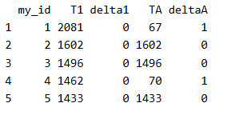
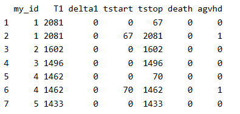

Source: https://www.emilyzabor.com/survival-analysis-in-r.html

```{r}
library(knitr)
library(dplyr)
library(survival)
library(ggplot2)
library(tibble)
library(lubridate)
library(ggsurvfit)
library(tidycmprsk)
library(gtsummary)


ezfun::set_ccf_palette("contrast")
```
# Part 2: Landmark Analysis and Time Dependent Covariates

1. Recap of Part 1: using log-rank tests and Cox regression to examine associations between covariates of interest and survival outcomes. 
   a. These analyses rely on the covariate being measured at **baseline** (i.e. before follow-up time for the event begins).
   b. Part 2: what happens if you are interested in a covariate that is measured *after* follow-up time begins?
  
2. **Example**: 
   a. Overall survival is measured from treatment start. 
   b. Goal: find the association between complete response to treatment and survival.
   c. Why traditional methods such as log-rank test or Cox regression are biased in favor of responders in this scenario (Anderson et al, 1983):
      i. **Landmark Approach**:
      ii. $H_0$: the survival from landmark does not depend on response status at landmark. 
   d. Some other possible covariates of interest in cancer research that may not be measured at baseline include:
      i. Transplant failure
      ii. Graft vs Host disease
      iii. Second resection
      iv. Adjuvant therapy
      v. Compliance
      vi. Adverse event

## The `BMT` Dataset
1. This section uses the `BMT` dataset from {SemiCompRisks} package as an example dataset. 
   a. The data consist of 137 bone marrow transplant patients. 
   b. Variables of Interest:
      i. `T1`: time in days to death or last follow-up.
      ii. `delta1`: death indicator; 1 = Dead, 0 = Alive.
      iii. `TA`: time in days to acute graft-versus-host disease.
      iv. `deltaA`: acute graft-versus-host disease indicator; 1 = developed acute graft-versus-host disease, 0 = never developed acute graft-versus-host disease. 
```{r}
data(BMT, package = "SemiCompRisks")

head(BMT[, c("T1", "delta1", "TA", "deltaA")])
```

## Landmark Approach
1. General Steps:
   a. Step 1: select a fixed time after baseline as your **landmark time**.
      i. Note: this should be done based on clinical information, prior to data inspection. 
   b. Step 2: subset population for those followed at least until landmark time. 
      i. Note: always report the number excluded due to the event of interest or censoring prior to the landmark time. 
   c. Step 3: calculate follow-up from landmark time and apply traditional log-rank tests or Cox regression. 
  
2. `BMT` Data Example
   a. Interest: association between acute graft versus host disease (aGVHD) and survival. 
   b. Problem: aGVHD is assessed after the transplant (baseline and also the start of follow up time). 
   c. Analysis:
      i. Step 1: select landmark time.
          - Typically aGVHD occurs within the first 90 days following transplant, so we use a **90-day** landmark. 
      ii. Step 2: subset ppulation for those followed at least until landmark time.
          - 15 patients were excluded as they were either dead or not followed until the landmark time of 90 days. 
```{r}
lm_dat <- BMT %>% 
  filter(T1 >= 90)

# Number of patients excluded:
nrow(BMT) - nrow(lm_dat)
```
      iii. Step 3: calculate follow-up time from landmark and apply traditional methods.
        - Fit survival curve using traditional methods: Kaplan-Meier estimator of survival probability.   
```{r}
lm_dat <-
  lm_dat %>% 
  mutate(
    lm_T1 = T1 - 90
  )
```
      
```{r}
survfit2(Surv(lm_T1, delta1) ~ deltaA, data = lm_dat) %>% 
  ggsurvfit() + 
  labs(
    x = "Days from 90-Day Landmark",
    y = "Overall Survival Probability"
  ) + 
  add_risktable()

```
 
      - In Cox regression you can use the `subset` option in `coxph` to exclude those patient who were not followed through the landmark time. 
      
```{r}
coxph(
  Surv(T1, delta1) ~ deltaA,
  subset = T1 >= 90,
  data = BMT
) %>% 
  tbl_regression(exp = TRUE)
```

## Time-dependent Covariate Approach

1. **Time-dependent covariate approach** is an alternative to a landmark analysis, which incorporates time-dependent covariates. 
  a. Time-dependent covariate approach is more appropraite than landmark analysis when:
    - The value of covariate is changing over time.
    - There is not an obvious landmark time. 
    - Use of a landmark would lead to many exclusions. 

  b. **Counting Process Format**: the special format required for analysis of time-dependent covariates.
  
    - To create counting process format, an ID variable column is needed in the dataset. 

```{r}
BMT <- rowid_to_column(BMT, "my_id")
```

    - Use the `tmerge` function with the `event` and `tdc` function options to create the counting process format dataset. 
      - `tmerge()`: creates a long dataset with multiple time intervals for the different covariate values for each patient. 
      - `event()`: creates the new event indicator to go with the newly created time intervals.
      - `tdc()`: creates the time-dependent covariate indicator to go with the newly created time intervals. 
```{r}
td_dat <- 
  tmerge(
    data1 = BMT %>% dplyr::select(my_id, T1, delta1),
    data2 = BMT %>% dplyr::select(my_id, T1, delta1, TA, deltaA),
    id = my_id,
    death = event(T1, delta1),
    agvhd = tdc(TA)
  )
```

    - Original data of the first 5 individual patients.
    
    
    - Counting process format data of the same 5 individual patients. 
    